[Back to HadCM3 for CMIP7](HadCM3_CMIP7.md)

## Terrestrial ensembles tuning

## Contents
- [Contents](#contents)
- [Overview](#overview)
- [Tuning by Seb](#tuning-by-seb)
- [Tuning by Yousheng](#tuning-by-yousheng)

## Overview

To prepare HadCM3B for CMIP7, the terrestrial carbon cycle required tuning to bring key variables (GPP, NPP, soil carbon, vegetation carbon) in line with modern observations. Two parallel tuning efforts were undertaken: Seb ran a large parameter ensemble to identify well-performing members, while Yousheng worked on the model configuration itself (land-use, soil parameters) and used Seb's results to select final candidates.

## Tuning by Seb

Seb's tuning used the [`hadcm3b-ensemble-validator`](https://github.com/sebsteinig/hadcm3b-ensemble-validator) framework to download, process, and score HadCM3B ensemble output against observational targets for the terrestrial carbon cycle. Ensembles were created and submitted via the companion [`hadcm3b-ensemble-generator`](https://github.com/sebsteinig/hadcm3b-ensemble-generator) on BC4. In total ~2974 members were run across 28 ensemble phases.

### Parameters perturbed

Each member varies a subset of TRIFFID/JULES land carbon cycle parameters across PFTs (broadleaf trees, needleleaf trees, C3 grass, C4 grass, shrubs):

| Parameter | Description |
| :-------- | :---------- |
| `ALPHA` | Quantum efficiency of photosynthesis |
| `G_AREA` | Leaf area index — area scaling |
| `LAI_MIN` | Minimum leaf area index |
| `NL0` | Top-leaf nitrogen concentration |
| `R_GROW` | Growth respiration fraction |
| `TLOW` / `TUPP` | Lower/upper temperature limits for photosynthesis |
| `V_CRIT_ALPHA` | Critical soil moisture for vegetation stress |
| `F0` | Ci/Ca ratio at zero humidity deficit |
| `Q10` | Soil respiration temperature sensitivity |
| `KAPS` | Specific decomposition rate of soil carbon |

### Ensemble phases

Runs were carried out in three broad phases, moving from wide random exploration to focused refinement around the best-performing regions of parameter space.

**Phase 1 — Initial exploration** (~50 members)

| Ensemble | Members | Score range | Notes |
| :------- | :------ | :---------- | :---- |
| `xpzn`   | 26 | 0.30–0.57 | Very early exploration; wide GPP range (85–186 PgC/yr) |
| `xqap`   | 25 | 0.21–0.44 | Early CMIP7-era test; scores generally low |

**Phase 2 — Large random sampling** (~1600 members)

Broad Latin hypercube / random sampling across the full parameter space to map out model sensitivity.

| Ensemble | Members | Score range | GPP range | Notes |
| :------- | :------ | :---------- | :-------- | :---- |
| `xqab_random` | 260 | 0.13–0.66 | 58–205 PgC/yr | First large random sweep |
| `xqac_soils`  | 101 | 0.51–0.74 | 117–119 PgC/yr | Soil-parameter-focused sweep; narrower GPP |
| `xqaq`        | 257 | 0.15–0.66 | 73–195 PgC/yr  | Second large random sweep |
| `xqar`        | 257 | 0.14–0.67 | 65–196 PgC/yr  | Third large random sweep |
| `xqau`        | 257 | 0.15–0.66 | 74–198 PgC/yr  | Fourth large random sweep |

`random_sampling_combined` aggregates all 771 members from `xqaq`, `xqar`, `xqau` for joint analysis.

**Phase 3 — Focused refinement** (~1300 members, 51 members per sub-ensemble)

Using the best-scoring members from Phase 2 as starting points, a grid of 51-member sub-ensembles was run with tighter parameter ranges, centred on promising regions. These are grouped by their parent random sweep:

| Sub-ensemble group | Ensembles | Typical score range | GPP range |
| :----------------- | :-------- | :------------------ | :-------- |
| `xqaq*` refinements | `xqaqg`, `xqaQh`, `xqaQs`, `xQaqc`, `Xqaqp`, `XqaqW` | 0.47–0.75 | 107–126 PgC/yr |
| `xqar*` refinements | `XQarc`, `xqaRd`, `xqare`, `Xqarh`, `XqArn`, `Xqarp`, `XqaRq`, `xqaRw` | 0.46–0.75 | 113–122 PgC/yr |
| `xqau*` refinements | `XqAuc`, `XqAuf`, `XqauI`, `xqauj`, `Xqaul`, `xQaup` | 0.47–0.74 | 108–122 PgC/yr |

### Results — top 23 candidates

After scoring all Phase 3 members against observational targets (GPP, CVeg, CSoil, regional RECCAP metrics), 23 top-performing ensemble configurations were identified:

`XqaqW`, `Xqarh`, `XqAuc`, `xQaup`, `XqaRq`, `XqAuf`, `Xqaul`, `xqare`, `xQaqc`, `Xqarp`, `Xqaqp`, `xqaRw`, `XQarc`, `xqaqg`, `XqauI`, `xqaQs`, `xqauj`, `xqaQh`, `xqaRd`, `XqArn`

These 23 form the candidate pool passed to Yousheng for final selection. Parameter files for each are in `id_lists/top_random_candidates_parameters.json` in the validator repository.

## Tuning by Yousheng

Yousheng's tuning focused on diagnosing and fixing the model configuration, working through a series of targeted changes before selecting candidates from Seb's shortlist.

### Step 1: Debugging the model

Initial preindustrial runs (e.g. `xqgtc`, `xqhuc`) showed terrestrial carbon cycle states far from observations. The root causes were identified and fixed — see [CMIP7 model](CMIP7_model.md) for the full list of mod changes.

### Step 2: Land-use configuration

Land-use ancillaries were updated and tested. Time-varying Hyde land-use data were introduced (experiment `xqcni` onwards), requiring the `disturb_grid_fix.mf77` mod and the `mod1702_cdj_2024.mf77` update to treat the disturbance field as a fraction rather than a rate.

### Step 3: Soil parameter changes

The land carbon cycle mod was updated from the default (`znamelist_hadcm3m21_land_cc.mod`) to a corrected version (`/user/home/nd20983/um_updates/znamelist_hadcm3m21_land_cc_v2.mod`), which picks up the correct soil parameter configuration. This was the primary fix that brought GPP, NPP, soil carbon and vegetation carbon back towards observed values.

### Step 4: Selecting candidates from Seb's ensemble

Seb's top 23 candidates span a wide range of V_CRIT_ALPHA (0.31–0.58). However, due to constraints in the new HadCM3B configuration, V_CRIT_ALPHA must remain close to the default value of 0.343. The top 23 were therefore filtered to those with V_CRIT_ALPHA ≲ 0.37, recorded in `input_params/hadcm3_selected_parameter_sets_28_Jan2026.csv` in the ensemble-generator repository. This gave 4 candidates from Seb's ensemble, plus 2 baseline/variant runs, submitted as experiments `xqjcg`–`xqjcl` (param table: `param_tables/xqjc.json`).

| Experiment | Source | V_CRIT_ALPHA | Notes |
| :--------- | :----- | :----------- | :---- |
| xqjcg | baseline (xpznj) | 0.343 | Default parameter set |
| xqjch | xqaQh | 0.361 | From Seb's top 23 |
| xqjci | XqArn | 0.326 | From Seb's top 23 |
| xqjcj | xqAuj | 0.314 | From Seb's top 23 |
| xqjck | xqarY | 0.344 | From Seb's top 23 |
| xqjcl | baseline variant | 0.343 | As xqjcg but lower NL0 |

Full per-PFT parameters for all 6 candidates (BL / NL / C3 / C4 / Shrub):

| Param | xqjcg | xqjch | xqjci | xqjcj | xqjck | xqjcl |
| :---- | :---- | :---- | :---- | :---- | :---- | :---- |
| ALPHA (BL) | 0.0800 | 0.0782 | 0.0409 | 0.0631 | 0.0900 | 0.0800 |
| G_AREA (BL) | 0.0040 | 0.0079 | 0.0068 | 0.0073 | 0.0077 | 0.0040 |
| F0 (BL/NL) | 0.875 | 0.875 | 0.875 | 0.875 | 0.875 | 0.875 |
| LAI_MIN (BL) | 4.000 | 2.763 | 2.106 | 3.188 | 3.595 | 4.000 |
| NL0 (BL) | 0.0500 | 0.0403 | 0.0403 | 0.0402 | 0.0431 | 0.0350 |
| R_GROW | 0.250 | 0.170 | 0.218 | 0.276 | 0.294 | 0.250 |
| TLOW (BL) | 0.0 | −2.7 | 4.5 | 3.4 | −5.0 | 0.0 |
| TUPP (BL) | 36.0 | 33.3 | 40.5 | 39.4 | 31.0 | 36.0 |
| V_CRIT_ALPHA | 0.343 | 0.361 | 0.326 | 0.314 | 0.344 | 0.343 |

### Validation results

Validation uses `utils_cmip7` against CMIP6 ensemble means and RECCAP2 observations. Results are stored in `validation_outputs/` in the utils_cmip7 repository.

Observational targets: GPP ~120 PgC/yr, NPP ~55–65 PgC/yr, CVeg ~450–550 PgC, CSoil ~1200 PgC. Bias shown in parentheses relative to target (midpoint used for ranges).

| Experiment | Score | GPP (PgC/yr, target 120) | NPP (PgC/yr, target 55–65) | CVeg (PgC, target 450–550) | CSoil (PgC, target 1200) |
| :--------- | :---- | :----------------------- | :------------------------- | :------------------------- | :----------------------- |
| **xqjcg** | 0.689 | 135.2 (+13%) | 68.3 (+14%) | 720.0 (+44%) | 1292.3 (+8%) |
| xqjch | 0.833 | 106.7 (−11%) | 62.2 (in range) | 444.4 (−11%) | 1176.4 (−2%) |
| xqjci | 0.833 | 101.4 (−16%) | 49.8 (−17%) | 460.6 (−8%) | 952.8 (−21%) |
| **xqjcj** | **0.870** | **110.3 (−8%)** | **53.6 (−11%)** | **446.2 (−11%)** | **1039.9 (−13%)** |
| xqjck | 0.763 | 110.1 (−8%) | 56.8 (in range) | 339.5 (−32%) | 1100.3 (−8%) |
| xqjcl | 0.830 | 98.4 (−18%) | 50.1 (−17%) | 483.2 (in range) | 984.8 (−18%) |

Global mean vegetation fractions — bias shown relative to IGBP observations (BL 0.173, NL 0.068, C3 0.256, C4 0.100, bare soil 0.288):

| Experiment | BL | NL | C3 | C4 | Bare soil |
| :--------- | :- | :- | :- | :- | :-------- |
| xqjcg | 0.232 (+34%) | 0.104 (+53%) | 0.145 (−43%) | 0.118 (+18%) | 0.176 (−39%) |
| xqjch | 0.201 (+16%) | 0.057 (−16%) | 0.190 (−26%) | 0.145 (+45%) | 0.178 (−38%) |
| xqjci | 0.214 (+24%) | 0.075 (+10%) | 0.224 (−13%) | 0.086 (−14%) | 0.201 (−30%) |
| **xqjcj** | **0.192 (+11%)** | **0.052 (−24%)** | **0.226 (−12%)** | **0.112 (+12%)** | **0.190 (−34%)** |
| xqjck | 0.159 (−8%) | 0.045 (−34%) | 0.190 (−26%) | 0.175 (+75%) | 0.178 (−38%) |
| xqjcl | 0.211 (+22%) | 0.046 (−32%) | 0.244 (−5%) | 0.102 (+2%) | 0.190 (−34%) |

**xqjcg** (the baseline default) performs worst — CVeg is far too high (720 PgC vs target ~500 PgC) and BL/NL fractions are substantially too high, indicating the untuned parameter set gives excessive tree cover.

**xqjcj** is the top-scoring candidate (0.870), with GPP, CVeg, and CSoil all close to observational targets and the most realistic vegetation fractions.

**xqjck** has unrealistically low CVeg (340 PgC) despite reasonable GPP and score, suggesting the parameter combination suppresses vegetation carbon storage too strongly.

**xqjci** and **xqjcl** produce slightly low GPP (~98–101 PgC/yr) and CSoil (~952–985 PgC), falling short of the lower end of observational targets.

### PPE validation heatmap

The `ppe_xqjcg` analysis in `utils_cmip7` evaluates the 6 candidates in the context of the full ~785-member combined dataset (Phase 2 + 3 ensemble members plus the xqjc* runs). The heatmap below shows the top 30 runs ranked by overall score, with the xqjc* experiments (and the two spin-up baselines xqhuc/xqhua) highlighted by red boxes:

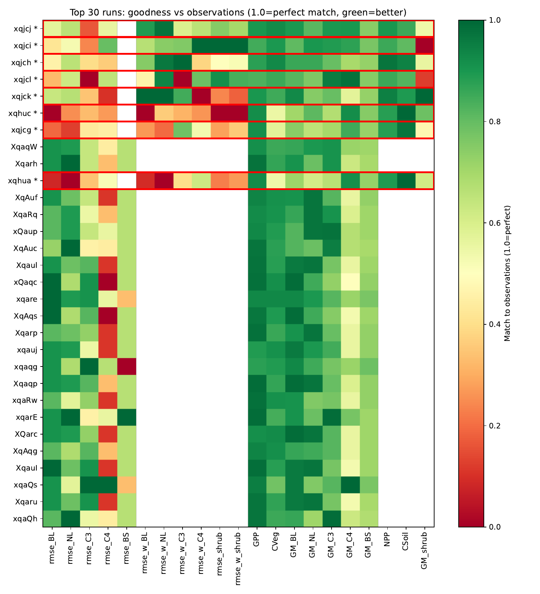

Columns show match-to-observations (1.0 = perfect, green = better) for spatial RMSE (BL, NL, C3, C4, bare-soil fractions), global carbon cycle (GPP, CVeg, NPP, CSoil) and global-mean vegetation fractions. Key observations:

- **xqjcj** (top row) is clearly the best overall — strong green across both carbon cycle and vegetation fraction metrics
- **xqjci, xqjch, xqjcl** are similarly close together in the 2nd–4th positions, with weaknesses mainly in the spatial RMSE columns (red = poor spatial pattern)
- **xqjck** has good carbon cycle scores but notably poor CSoil match
- **xqjcg** (baseline, 7th) is the weakest of the 6 — poor NL RMSE and CVeg — yet still outscores most of the raw Phase 3 ensemble members below it
- The Phase 3 members (lower rows) score well on vegetation fractions (right columns, mostly green) but are less well-constrained on global carbon cycle totals

### Regional bias

Regional bias heatmaps from `utils_cmip7` compare each candidate against RECCAP2 observations across 10 regions. Each section is collapsible.

<strong>xqjcg</strong> — baseline, score 0.689

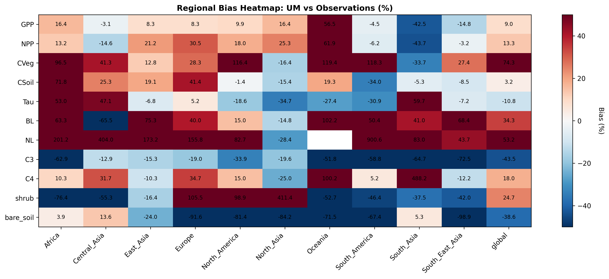

Key patterns:
- **NL fraction**: massively overestimated almost everywhere (Oceania +900%, Central Asia +400%, Africa +200%), indicating too much needleleaf tree cover
- **C3 fraction**: consistently underestimated (Africa −63%, South America −52%, South Asia −65%), displaced by excessive BL/NL
- **CVeg**: strongly overestimated in tropical/subtropical regions — Africa +96%, North America +116%, South America +118%, Oceania +119%
- **GPP**: overestimated in Africa/North Asia (+16%) and Oceania (+57%); underestimated in South Asia (−43%) and South East Asia (−15%)
- **CSoil**: mixed — too high in Africa (+72%) and Europe (+41%), reasonable or slightly low elsewhere
- **Tau**: turnover time too long in Africa (+53%) and Central Asia (+47%), too short in South Asia (−60%)

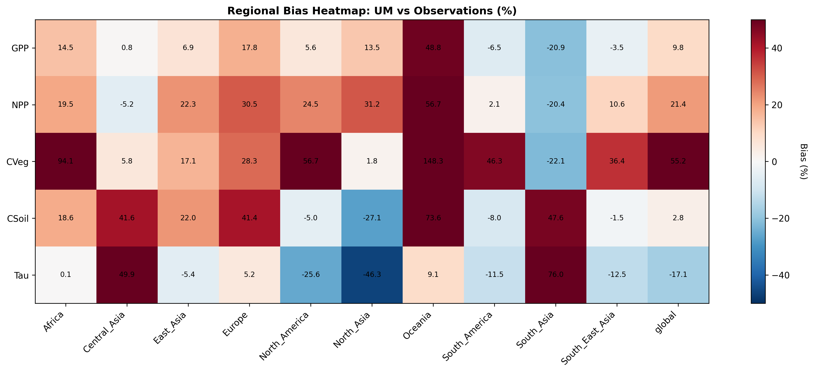

<strong>xqjch</strong> — score 0.833

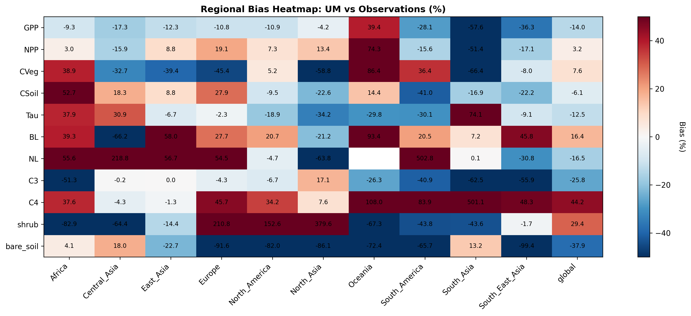

Key patterns:
- **GPP**: globally −14%, worst in South Asia (−58%) and South East Asia (−36%); Oceania overestimated (+39%)
- **NL fraction**: strongly underestimated in Central Asia (−220%) but still too high in Oceania (+503%)
- **C4 fraction**: overestimated globally (+44%), extreme in South Asia (+501%) and Oceania (+108%)
- **CVeg**: regionally mixed — underestimated in Africa (−39%) and Europe (−45%), overestimated in Oceania (+69%)
- **CSoil**: globally near target (−6%), Africa (−53%) and South Asia (−17%) are exceptions

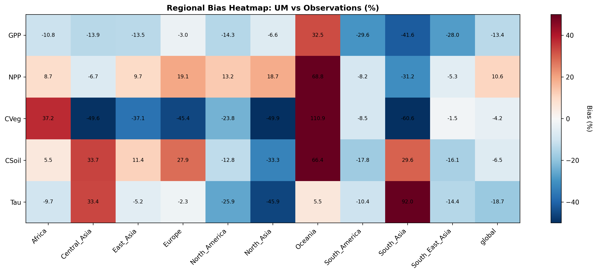

<strong>xqjci</strong> — score 0.833

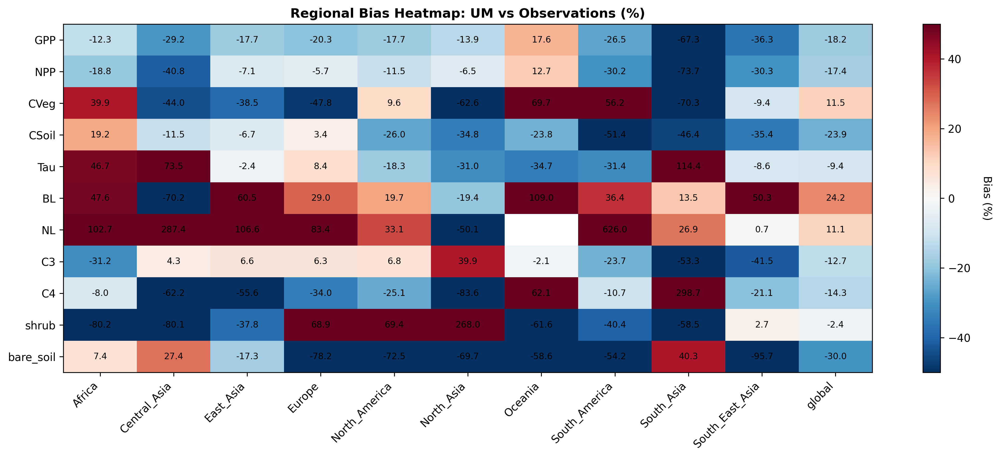

Key patterns:
- **GPP**: globally −18%, widespread underestimation; only Oceania positive (+18%)
- **NPP**: globally −17%, following GPP closely
- **NL fraction**: strongly overestimated in Central Asia (+287%) and South America (+626%), indicating excessive needleleaf cover in those regions
- **CVeg**: modest global overestimate (+12%), dominated by Oceania (+70%) and South America (+58%); Africa and Europe underestimated
- **CSoil**: globally low (−24%), fairly uniform across regions
- **Tau**: too long in Africa (+47%) and Central Asia (+74%), too short in South Asia (−114%)

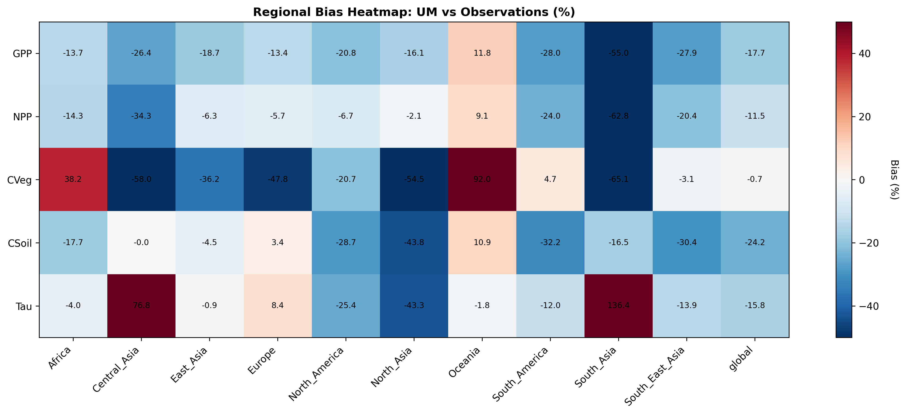

<strong>xqjcj</strong> — best candidate, score 0.870

Key patterns:
- **GPP**: globally −11%, moderate underestimation; Oceania is an exception (+34%)
- **CVeg**: modest global bias (+8%), with regional spread — Africa (−43%), Oceania (+69%)
- **CSoil**: globally low (−17%), the most uniform of all candidates
- **BL fraction**: slight overestimate globally (+11%), driven by Oceania (+81%) and Africa (+38%); otherwise closest to observations
- **NL fraction**: globally −23%, too low in most regions but still strongly overestimated in Oceania (+407%)
- **C3 fraction**: moderate underestimate globally (−12%), worst in South Asia (−57%) and Africa (−36%)
- Overall the most balanced regional performance, with no extreme outliers in carbon cycle metrics

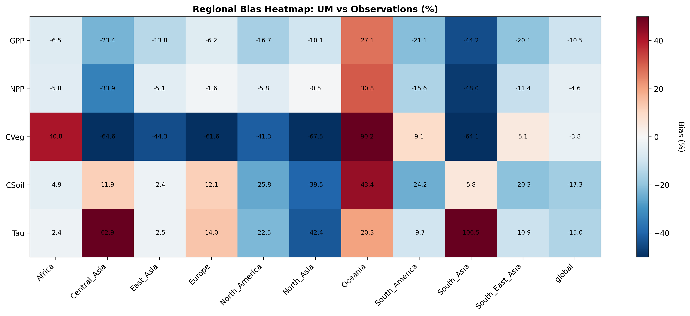

<strong>xqjck</strong> — score 0.763

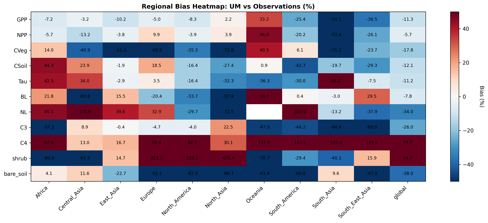

Key patterns:
- **C4 fraction**: very strongly overestimated globally (+75%), with extreme values in Oceania (+132%) and South America (+142%); South Asia severely underestimated (−545%)
- **Shrubs**: strongly overestimated globally (+55%), extreme in Oceania (+425%) and North America (+229%)
- **CVeg**: globally low (−18%), consistent with the parameter set suppressing tree cover in favour of C4/shrubs
- **NL fraction**: strongly underestimated globally (−34%), Central Asia (−174%)
- **GPP/NPP**: modest global bias (−11%/−6%), masking large regional cancellations
- **CSoil**: mixed — Africa (+44%) but South America (−43%) and South Asia (−20%) too low

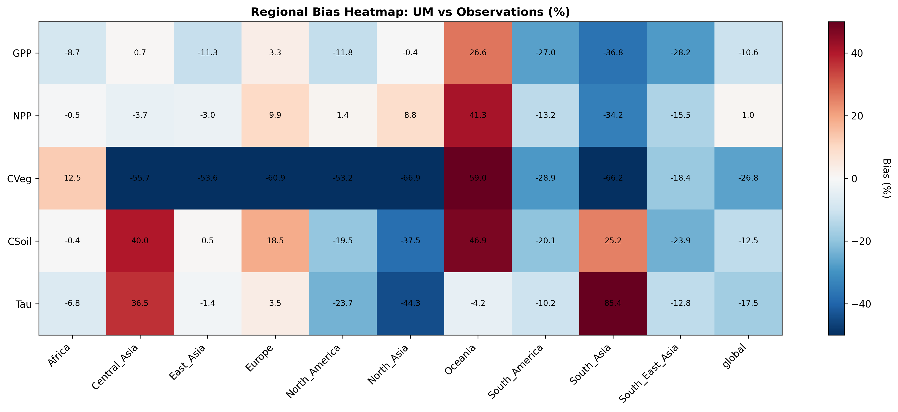

<strong>xqjcl</strong> — score 0.830

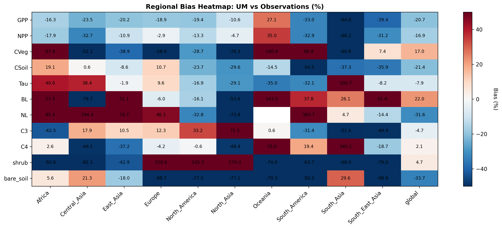

Key patterns:
- **GPP**: the most strongly underestimated globally of all candidates (−21%), consistent across almost all regions; Oceania (+27%) is the sole exception
- **CVeg**: globally overestimated (+17%), driven by Oceania (+140%) and Africa (+68%); most other regions near target
- **BL fraction**: strongly overestimated in Oceania (+144%) and Africa (+58%), suggesting excessive broadleaf tree cover there
- **NL fraction**: globally low (−32%), Central Asia very low (−194%), but Oceania still too high (+384%)
- **C3 fraction**: the best C3 match of all candidates (−5% globally), reasonable across most regions
- **CSoil**: globally low (−21%), fairly uniform

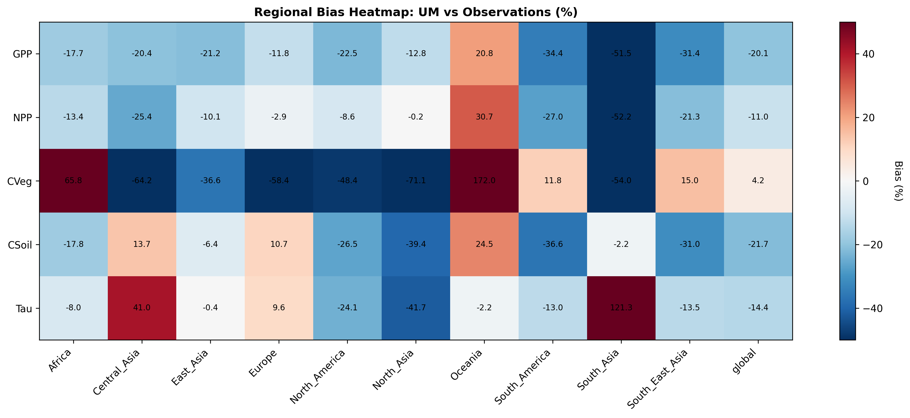

